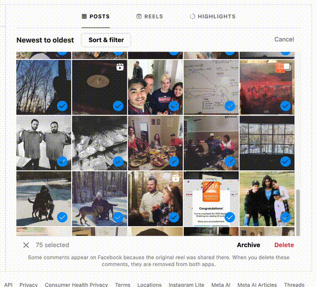

# Bulk Archive Instagram Posts

A browser automation script to archive all of your Instagram posts in batches. This script automatically selects up to 100 posts at a time and archives them, repeating until all posts have been archived.



## How It Works

The script:
- Automatically selects up to 100 posts per batch (Instagram's limit)
- Scrolls through your posts to load more content
- Clicks the Archive button and confirms the action
- Repeats the process until all posts are archived
- Shows progress in the browser console

## Usage

### Step 1: Navigate to Your Posts Page

Go to your Instagram posts management page:
```
https://www.instagram.com/your_activity/photos_and_videos/posts/
```

Make sure you're logged into your Instagram account.

### Step 2: Open the Browser Console

- **Chrome/Edge**: Press `F12` or `Ctrl+Shift+J` (Windows/Linux) / `Cmd+Option+J` (Mac)
- **Firefox**: Press `F12` or `Ctrl+Shift+K` (Windows/Linux) / `Cmd+Option+K` (Mac)
- **Safari**: Enable Developer menu first (Preferences → Advanced → Show Develop menu), then press `Cmd+Option+C`

### Step 3: Paste and Run the Script

1. Copy the entire contents of `bulk-archive-instagram-posts.js`
2. Paste it into the browser console
3. Press `Enter` to run the script

The script will start automatically and show progress messages in the console like:
- `🔹 Starting batch #1`
- `✅ Selected 100 posts this round.`
- `📦 Clicking Archive bar…`
- `🗄️ Clicking Archive confirmation button…`
- `✅ Batch #1 archived 100 posts.`

### Step 4: Let It Run

The script will:
- Process posts in batches of up to 100
- Automatically wait for pages to load
- Continue until all posts are archived
- Display a completion message: `🎉 All done! Every batch has been archived.`

**Note**: Keep the browser tab open and active while the script is running. You can minimize the window, but don't close the tab or navigate away.

## Unarchiving Posts

If you want to unarchive your posts later:

1. Go to your Instagram profile
2. Click the **"View Archive"** button (or the clock icon)
3. Select the posts you want to restore
4. Click **"Show on Profile"** to unarchive them

## Important Notes

- ⚠️ **This action archives posts, not deletes them** - Your posts will be hidden from your profile but can be restored
- The script processes posts in batches of up to 100 (Instagram's selection limit)
- The script includes automatic retry logic if Instagram is slow to load
- You may see a confirmation dialog if the script can't find the "Select" button - you can choose to continue waiting or stop
- Keep the browser tab active while the script runs
- The script will automatically stop when all posts are archived

## Troubleshooting

- **Script stops unexpectedly**: Check the console for error messages. You may need to refresh the page and start again
- **"Select" button not found**: Instagram may be loading slowly. The script will prompt you to wait longer or stop
- **Posts not archiving**: Make sure you're on the correct page (`/your_activity/photos_and_videos/posts/`) and that the page has fully loaded before running the script

## Technical Details

The script uses:
- DOM manipulation to interact with Instagram's interface
- Automatic scrolling to load more posts
- Batch processing (100 posts at a time)
- Error handling and retry logic
- Console logging for progress tracking
